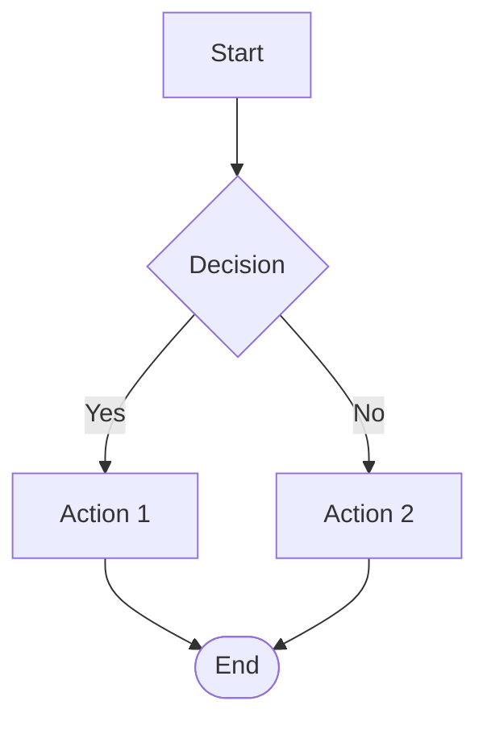
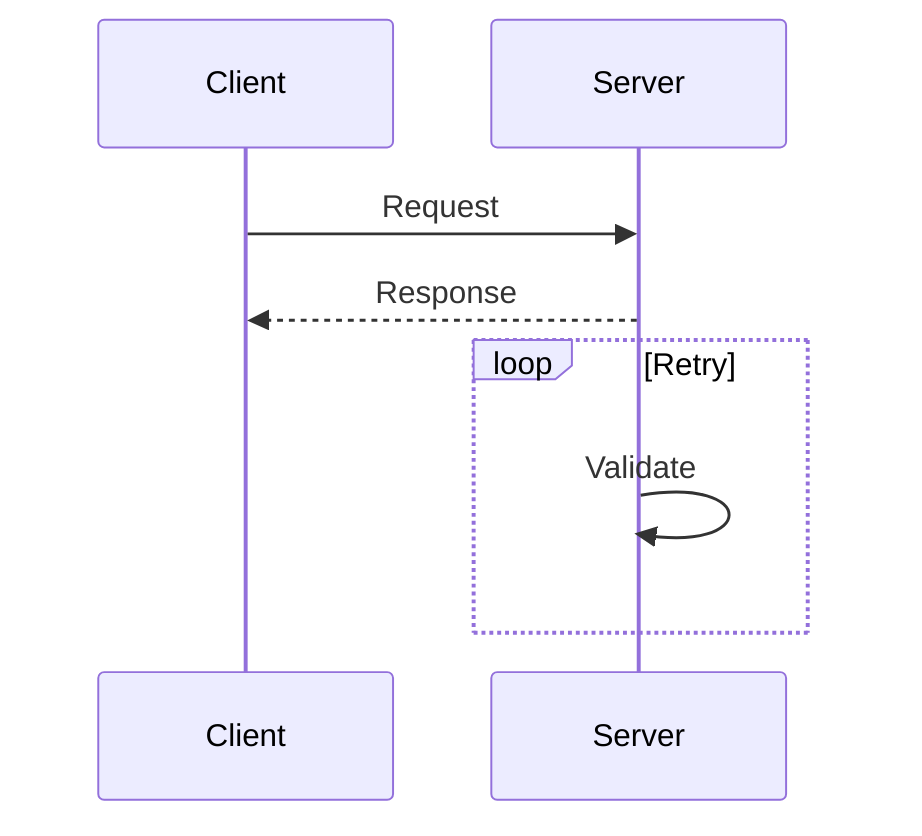
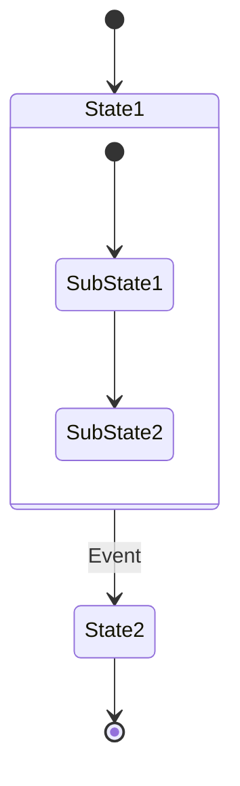

# Mermaid Diagrams

## General Syntax

- `flowchart` (not deprecated `graph`); 2 spaces indent
- Escape special characters with quotes: `A["Text with → arrow"]`
- HTML entities: `#8594;` for →; line breaks: ` `
- Close all blocks: `subgraph`, `loop`, `alt`, `opt`, `par` — with `end`

## Flowcharts

- `flowchart TD` (top-down) or `flowchart LR` (left-right)
- Nodes: `[rect]`, `(rounded)`, `{diamond}`, `((circle))`, `([stadium])`
- Arrows: `-->` solid, `-.->` dotted, `==>` thick; labels: `-->|Yes|`

## Sequence Diagrams

- `participant Name as Label`
- Messages: `->>` async, `->` sync, `-->>` response
- Blocks: `loop`, `alt`, `opt`, `par` — close with `end`
- `Note right of B: text`

## Class Diagrams

- Visibility: `+` public, `-` private, `#` protected
- Relationships: `<|--` inheritance, `*--` composition, `o--` aggregation
- Cardinality: `"1" --> "0..*"`

## State Diagrams

- `stateDiagram-v2`; start/end: `[*]`
- Transitions: `State1 --> State2 : Event`
- Nested: `state StateName { ... }`

## Module & Component Structure

- `flowchart TB` + `subgraph "Group Name"` for architecture layer grouping
- `flowchart LR` for component interaction; label protocols: `-->|HTTP/REST|`
- DB nodes: `(())`; service nodes: `[]`

## ER Diagrams

- `erDiagram`
- `||--o{` one-to-many, `||--||` one-to-one, `}o--o{` many-to-many
- Attributes in `{}`; mark PK/FK/UK

## GitFlow

- `gitGraph`
- `branch name`, `checkout name`, `merge name`
- `commit id: "label"`

## Validation Checklist

- Correct diagram type (not `graph`)
- Arrows use proper syntax for diagram type
- Special characters escaped with quotes
- All blocks closed with `end`

## Flutter Use Cases

- BLoC state → `stateDiagram-v2`
- Clean Architecture layers → `flowchart TB` + subgraph
- API flows → `sequenceDiagram`
- Navigation logic → `flowchart`
- Widget lifecycle → `stateDiagram`
