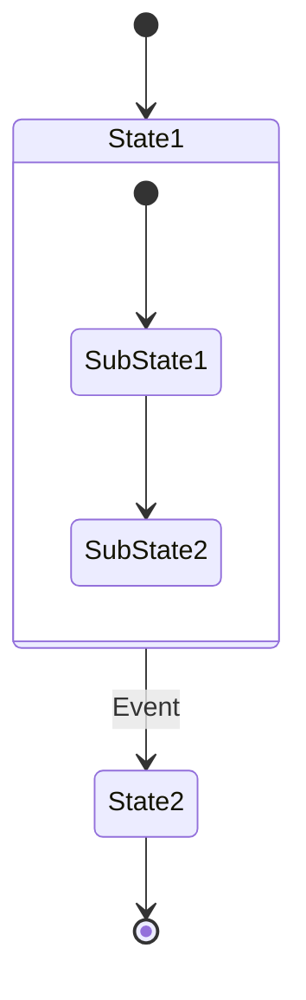

# Class Diagrams

- Visibility: `+` public, `-` private, `#` protected
- Relationships: `<|--` inheritance, `*--` composition, `o--` aggregation
- Cardinality: `"1" --> "0..*"` for relationships

# State Diagrams

- Use `stateDiagram-v2`
- Start/end with `[*]`
- Nest states: `state StateName { ... }`
- Transitions: `State1 --> State2 : Event`

## State Example

