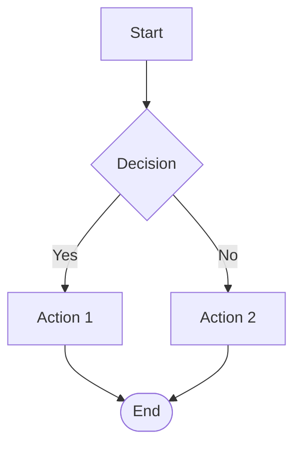

# Flowcharts (Modern)

## Directive

- Use `flowchart TD` (top-down) or `flowchart LR` (left-right).
- Do NOT use deprecated `graph`.

## Node Shapes

- `[rectangle]`, `(rounded)`, `{diamond}`, `((circle))`, `([stadium])`

## Arrows

- `-->` solid
- `-.->` dotted
- `==>` thick
- Labels: `-->|Yes|` or `-->|No|`

## Example

