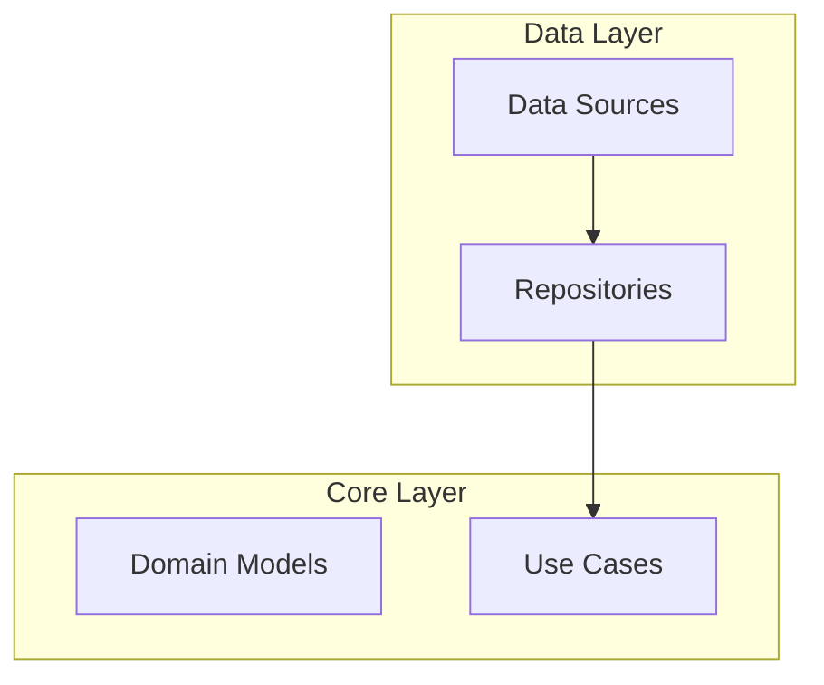

# Module Structure

- Use `flowchart TB` (top-bottom)
- Group with `subgraph "Group Name"`
- Show dependencies with `-->`
- Use descriptive names in brackets

# Component Interaction

- Use `flowchart LR` (left-right)
- Label protocols on arrows: `|HTTP/REST|`, `|gRPC|`
- Databases: `(())`; services: `[]`
- Show data flow direction

## Example (Module)

