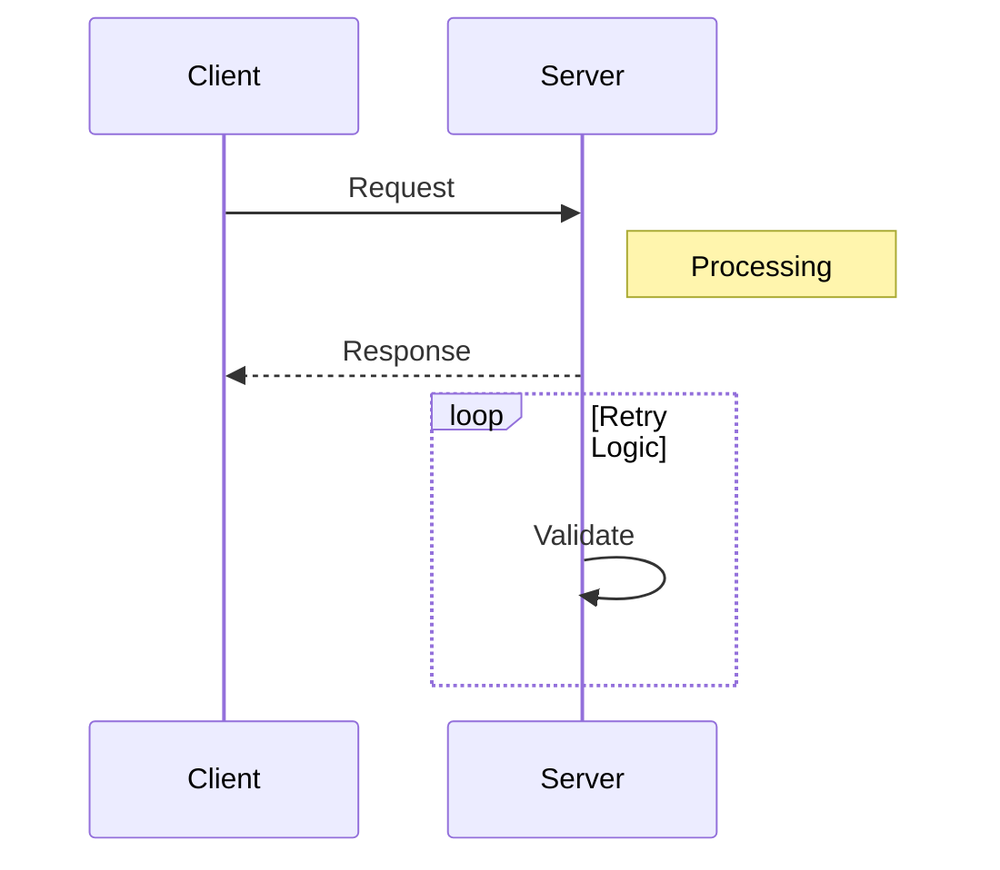

# Sequence Diagrams

## Participants

- Define with `participant Name as Label`

## Message Types

- `->>` solid arrow (async)
- `->` sync
- `-->>` dotted arrow (response)

## Blocks

- `loop`, `alt`, `opt`, `par` — always close with `end`

## Example

